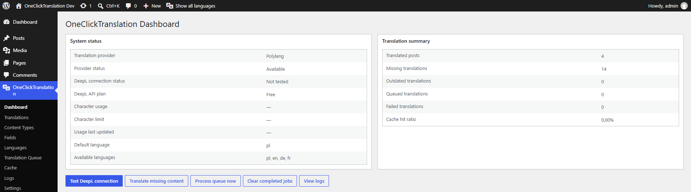
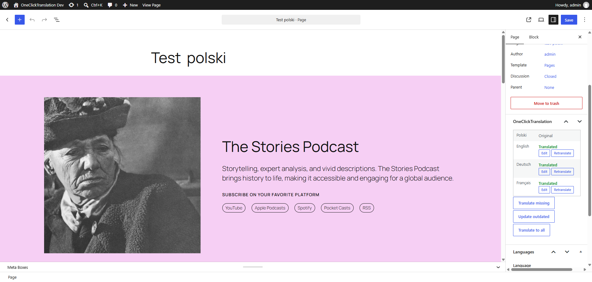
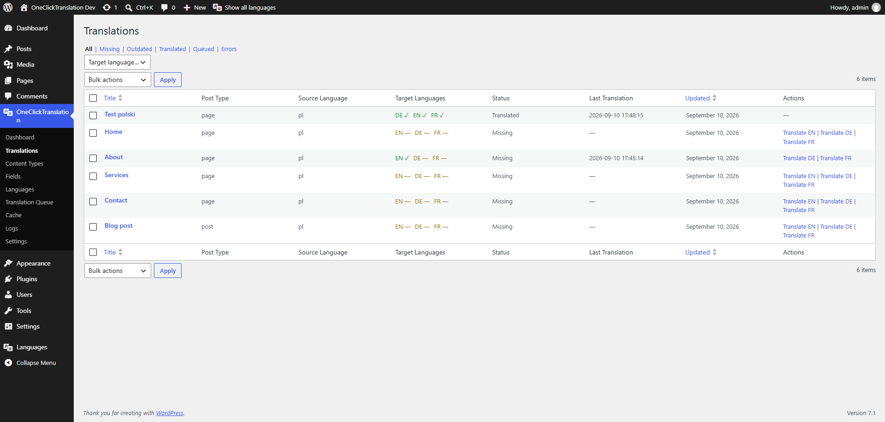

# OneClickTranslation

[Wersja polska](README.md)

A complete WordPress plugin that integrates the DeepL API with WPML and Polylang. This repository includes the plugin source code, Docker development environment, automated development-data setup, WP-CLI commands, and tests.

## Features

- translates posts, pages, public custom post types, Gutenberg content, taxonomy terms, postmeta, and recursive ACF fields;
- uses WPML/Polylang adapters, leaving languages and translation relationships under the provider's ownership;
- provides batching, deduplication, SHA-256 cache keys, DeepL context, and HTML/shortcode/URL protection;
- includes a WP-Cron queue with locking and retries, automatic updates, source hashes, and translation statuses;
- offers native wp-admin screens, bulk actions, REST API, logs, usage statistics, and WP-CLI support.

## Screenshots

### Dashboard



### Translation controls in the block editor



### Translation overview



## Requirements

Running without Docker requires WordPress 6.4+, PHP 8.2+, MariaDB/MySQL, WPML or Polylang, and a DeepL API key. The development image uses PHP 8.3 and MariaDB 11.4.

## Docker setup

```bash
cp .env.example .env
docker compose up -d
bash bin/setup.sh
```

Windows PowerShell:

```powershell
Copy-Item .env.example .env
./bin/setup.ps1
```

Services: WordPress at `http://localhost:8080`, Mailpit at `http://localhost:8025`, and Adminer at `http://localhost:8081`. The `./plugin` folder is mounted directly into `wp-content/plugins/oneclicktranslation`.

## Installation and DeepL configuration

For a conventional installation, copy `plugin/` into `wp-content/plugins/oneclicktranslation` and activate it. Store the key in the settings screen or, preferably, define it outside the database:

```php
define('OCT_DEEPL_API_KEY', getenv('DEEPL_API_KEY') ?: '');
```

The constant takes precedence. No real DeepL key is included in this repository.

## WPML and Polylang setup

Configure languages, post types, and taxonomies in WPML or Polylang. If both are active, select the provider in **OneClickTranslation → Settings → General**. WPML custom-field preferences take priority; configure Polylang field strategies under **Fields**.

## Custom fields, ACF, and Gutenberg

Translate/Copy/Ignore policies work for PHP-serialized values, JSON, arrays, and objects. ACF support covers groups, repeaters, flexible content, clones, links, and relationship fields. The test fixture is located at `plugin/tests/fixtures/acf-field-group.json`. Gutenberg blocks are parsed and serialized with WordPress APIs without modifying technical identifiers.

## WP-CLI

```bash
wp oct status
wp oct translate 123 --to=en,de
wp oct translate-missing --to=en
wp oct update-outdated
wp oct queue run
wp oct queue status
wp oct cache clear
wp oct logs clear
```

## Hooks

The plugin provides the documented `oct_before_translate_*`, `oct_after_translate_*`, `oct_translation_*`, and `oct_queue_job_*` actions, plus the `oct_should_translate_field`, `oct_field_strategy`, `oct_translation_context`, `oct_supported_post_types`, `oct_deepl_options`, and `oct_translation_batch` filters. Full signatures are documented in the [plugin documentation](plugin/README.md#hooks).

## Troubleshooting and development

No provider means WPML/Polylang is inactive, or both providers need an explicit choice. HTTP 403 normally indicates an incorrect endpoint type or API key; 456 indicates an exhausted quota. Process pending jobs with `wp oct queue run`. Set `OCT_DEBUG=true` for additional diagnostics.

```bash
cd plugin
composer install
composer lint
composer test
composer analyse
```

Detailed information about installation, DeepL, WPML, Polylang, fields, ACF, Gutenberg, REST, hooks, troubleshooting, and testing is available in [plugin/README.md](plugin/README.md).
